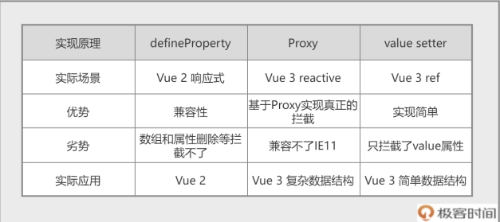

#### vue 3种响应方案：defineProperty、Proxy、value setter

vue2  defineProperty

```js
let getDouble = n => n * 2
let obj = {}
let count = 1
let double = getDouble(count)

Object.defineProperty(obj, 'count', {
  get() {
    return count
  },
  set(val) {
    count = val
    double = getDouble(count)
  }
})
console.log(double)
obj.count = 2
console.log(double)
```

##### 缺陷：删除obj.count属性，set函数不会执行，double还是之前的数值，所以vue2种需要一个专门的函数$delete去删除数据

```js
delete obj.count
console.log(double) // double还是4
```

vue3  proxy

```js
let proxy = new proxy(obj, {
  get(target, prop) {
    return target[prop]
  },
  set(target, prop, value) {
    target[prop] = value
    if (prop === 'count') {
      double = getDouble(value)
    }
  },
  deleteProperty(target, prop) {
    delete target[prop]
    if (prop === 'count') {
      double = NaN
    }
  }
})
console.log(obj.count, double)
proxy.count = 2
console.log(obj.count, double)
delete proxy.count
// 删除属性后，我们打印log时，输出结果会是undefined NaN
console.log(obj.count, double)
```

#### 可以监听到属性的删除，因为是针对对象来监听，不只是某个具体属性，所以可以代理哪些定义是不存在的属性，还可以代理更丰富的数据结构，比如Map、Set，还可以通过deleteProperty实现删除操作的代理



实用库vue use!!!
